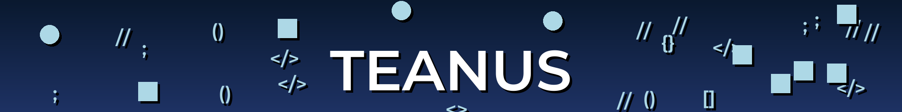

# TEANUS Cover Boosty Generator



## Описание

TEANUS Cover Boosty Generator — это ваш верный помощник в создании самых <b>НЕКРАСИВЫХ ОБЛОЖЕК</b> для вашего Boosty! Этот скрипт гарантированно добавит хаос и безумие в ваши обложки, которые заставят ваших друзей и подписчиков на Boosty задуматься: "Что тут вообще происходит?!"

## Функциональность

- Создание уникального градиентного фона, который как будто пытался быть красивым, но что-то пошло не так.
- Рисование текста с тенью, чтобы ваш заголовок выглядел ещё более драматично.
- Разброс случайных программных символов вокруг текста, которые выглядят так, будто код сам решил свалить на обложку.
- Добавление иконок (кругов и квадратов) с тенью, которые не нашли себе места и решили поселиться на вашем фоне.
- Полная настройка цветов, шрифтов и других параметров для создания "шедевра".

## Использование

### Требования

- Python 3.x
- PIL (Pillow)

Установите Pillow, если оно еще не установлено:

```bash
pip install pillow
```

### Запуск

1. Клонируйте репозиторий или загрузите файлы проекта.

2. Убедитесь, что файл шрифта `Montserrat-SemiBold.ttf` находится в той же директории, что и скрипт.

3. Запустите скрипт и наслаждайтесь результатом:

```bash
python main.py
```

### Настройка

Вы можете настроить скрипт, изменив следующие параметры:

- Размер изображения (`width`, `height`) - хотите больше хаоса? Увеличьте размер!
- Цвета градиента (`start_color`, `end_color`) - выберите свои любимые цвета и посмотрите, что получится.
- Параметры текста (`text`, `text_color`, `font_path`, `font_size`) - напишите что угодно, результат всё равно будет неожиданным.
- Параметры символов (`symbols`, `symbol_color`, `symbol_font_size`) - добавьте больше символов для ещё большей путаницы.
- Параметры иконок (`icon_color`, `icon_size`) - измените размеры иконок и наслаждайтесь визуальным беспорядком.

## Структура кода

- **create_gradient_background**: Создает градиентный фон, который сразу дает понять, что что-то пошло не так.
- **draw_text_with_shadow**: Рисует текст с тенью, потому что простого текста недостаточно для такой красоты.
- **draw_symbol_with_shadow**: Разбрасывает символы с тенью, которые добавляют ощущение, что ваш код сошел с ума.
- **draw_icon_with_shadow**: Добавляет иконки, которые просто не могут найти себе места.
- **is_outside_text_area**: Проверяет, находятся ли символы и иконки за пределами текста, чтобы создать максимальный беспорядок.
- **main**: Основная функция, которая создает это чудо и сохраняет его на ваш компьютер, чтобы вы могли поделиться этим шедевром с миром.

## Контакты

- 🚀 [Бусти](https://boosty.to/teanus)
- ✉️ [Telegram](https://t.me/teanus)
- 💬 [ВКонтакте](https://vk.com/dimawinchester)
- 🌐 [Личный сайт](https://teanus.ru)

